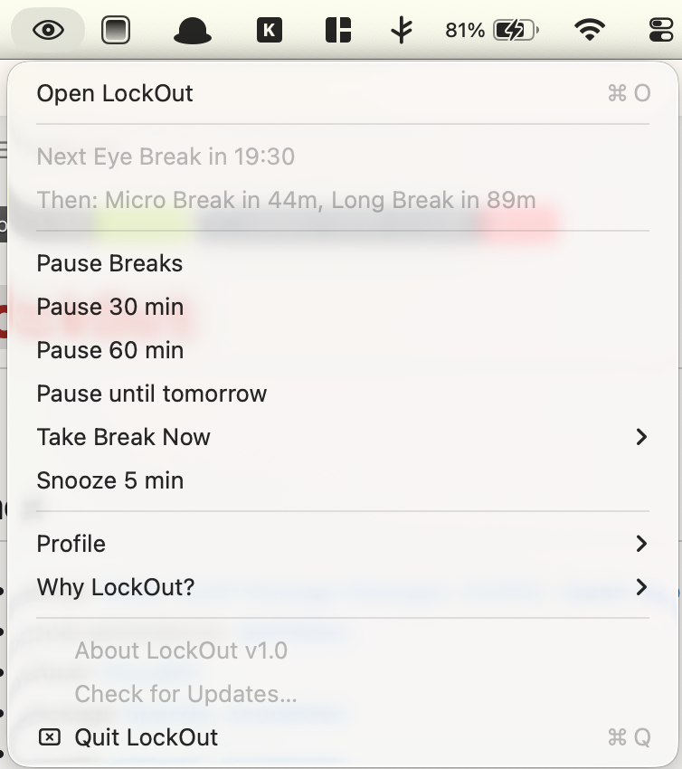
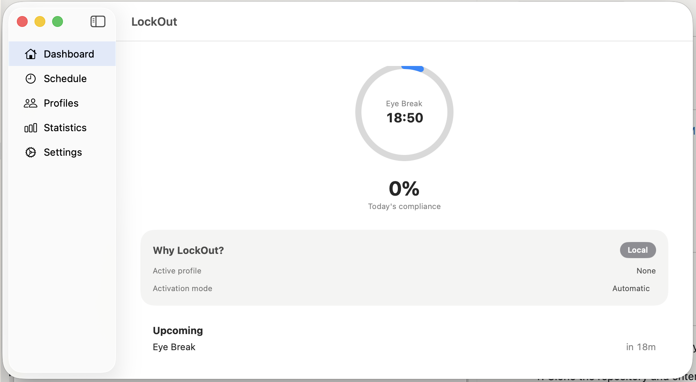
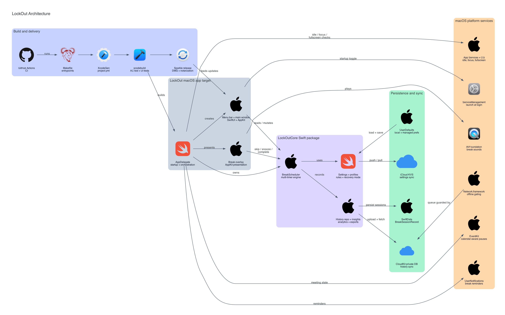

[](https://github.com/gongahkia/lockout/releases/tag/1.0.0)


# `LockOut`

...

## Stack

* *Script*: [Swift](https://www.swift.org/), [Swift Package Manager](https://www.swift.org/package-manager/), [SwiftUI](https://developer.apple.com/xcode/swiftui/), [Apple AppKit](https://developer.apple.com/documentation/appkit), 
* *Local persistence*: [SwiftData](https://developer.apple.com/documentation/swiftdata)
* *Cloud*: [CloudKit](https://developer.apple.com/icloud/cloudkit/)
* *Package* [Sparkle](https://www.thesparkleproject.org/), [XcodeGen](https://xcodegen.com/)
* *CI/CD*: [Github Actions](https://github.com/features/actions)

## Screenshot

<div align="center">
    
    
</div>

## Usage

The below instructions are for locally running `LockOut`.

1. Clone the repository and enter the project directory.

```console
$ git clone https://github.com/gongahkia/lockout && cd lockout
```

2. Create a local `Config.xcconfig` file and fill with the required values before building.

```console
$ make setup-config
$ open Config.xcconfig
```

3. Finally run the below command to build `LockOut` in [Xcode](https://developer.apple.com/xcode/).

```console
$ open LockOut.xcodeproj # for running and building in Xcode directly

$ xcodebuild -project LockOut.xcodeproj -scheme LockOut-macOS -destination 'platform=macOS' -derivedDataPath .derivedData CODE_SIGNING_ALLOWED=NO build
$ open .derivedData/Build/Products/Debug/LockOut.app # for building straight from the CLI

$ make test # make commands for convenient build
$ make build
```

## Architecture

